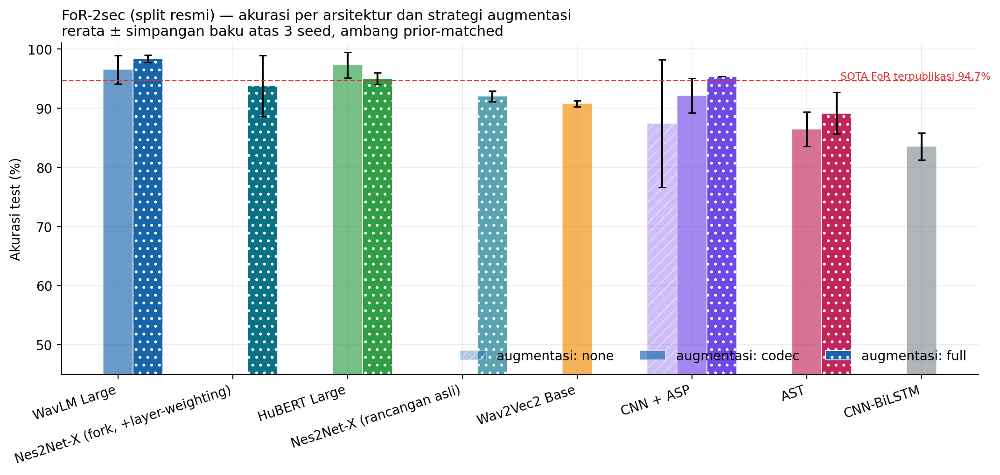
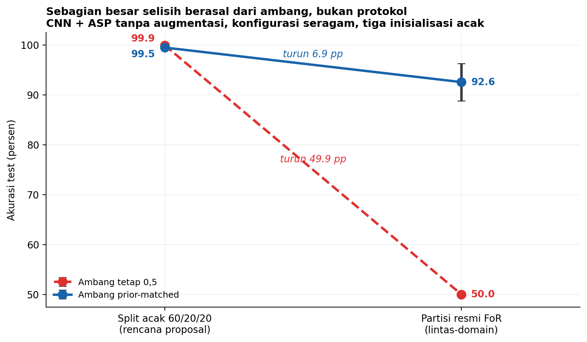
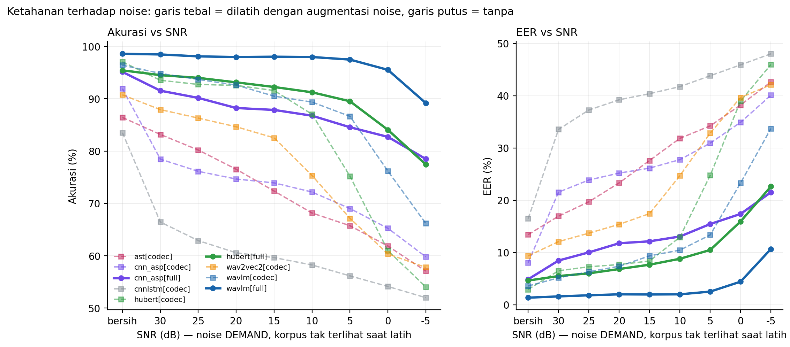
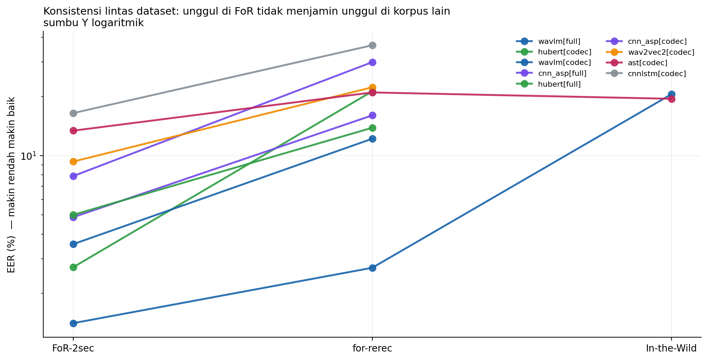
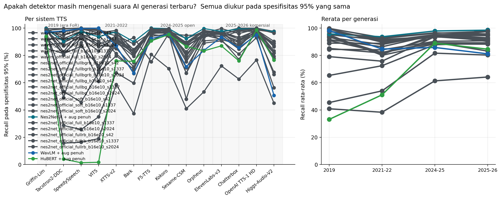
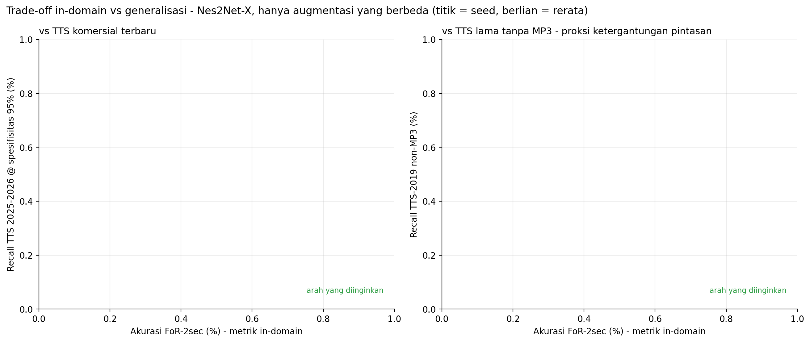
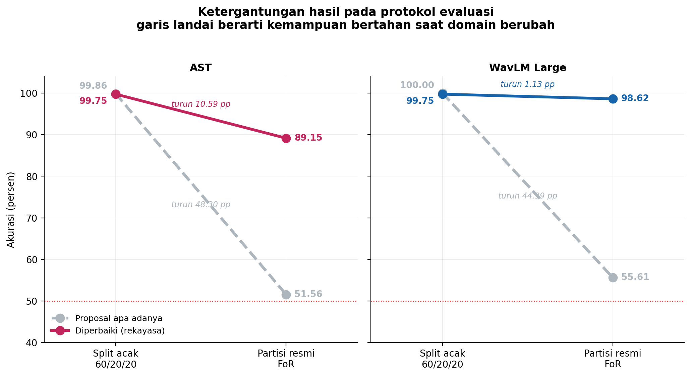
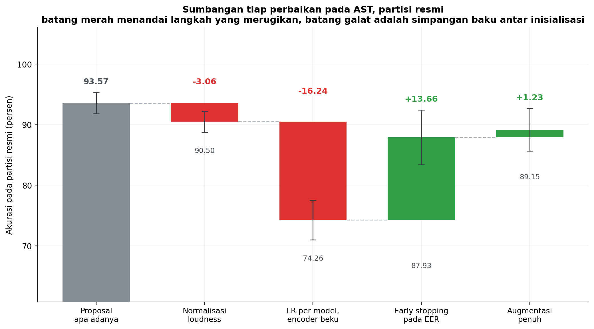
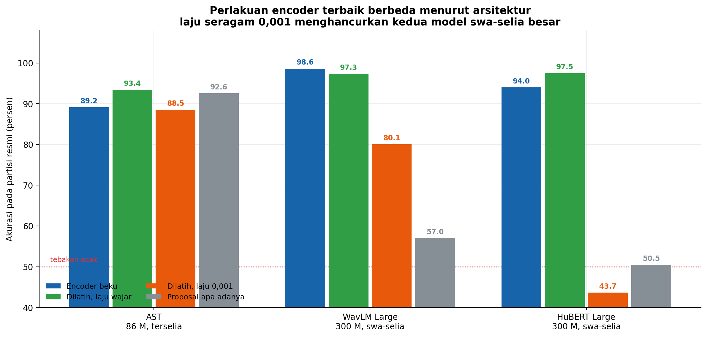

# Deteksi Deepfake Audio: Analisis, Replikasi, dan Temuan

Repositori riset untuk tesis S2 *"Analisis Performa Arsitektur Deep Learning
Wav2Vec2, AST, HuBERT, dan CNN-LSTM dalam Klasifikasi Suara Deepfake dan Suara Asli"*
(ITB STIKOM Bali). Berisi kode, hasil eksperimen, grafik, dan dokumentasi temuan.

> Dataset, bobot model, dan arsip tidak disertakan (89 GB). Lihat
> [Reproduksi](#reproduksi) untuk cara mengunduhnya.

---

## Temuan utama

**1. Protokol pembagian data menentukan hasil, bukan model.**
Dengan arsitektur, data, dan hyperparameter yang identik, split acak 60/20/20
menghasilkan akurasi **99,94%** sementara partisi resmi FoR menghasilkan **50,00%**.
Selisih ~50 poin sepenuhnya berasal dari skema pembagian data.

**2. Penyebabnya artefak provenance codec, dan terukur.**
Pada FoR-2sec, **90,7%** sampel `fake` di data latih berasal dari MP3, tetapi
**0%** di data uji. Model belajar mendeteksi jejak MP3, bukan sintesis.
Energi >6 kHz: real 0,0336 vs fake-dari-MP3 0,0080 (4,18×), tetapi vs
fake-non-MP3 hanya 1,17×.

**3. Akurasi in-domain berkorelasi NEGATIF dengan deteksi TTS modern.**
r = −0,542 (n=7). Bukti paling telanjang: `hubert[full]` mencapai akurasi FoR
**95,3%** tetapi recall hanya **2,3%** pada TTS 2019 yang tidak dikompresi MP3.
Model itu praktis mendeteksi MP3, bukan deepfake.

**4. Kegagalan di bawah noise sebagian besar adalah kegagalan KALIBRASI.**
WavLM pada SNR 10 dB masih ber-AUC **0,962**, yaitu daya pisah nyaris utuh, tetapi
akurasi pada ambang beku hanya 59,8%. Koreksi ambang saja memulihkan **+29,6 poin**.
CNN-LSTM gagal dengan cara berbeda: AUC-nya benar-benar jatuh ke 0,605.

**5. Model SOTA publik runtuh total di luar domainnya.**
Nes2Net-X (EER 1,49% pada ASVspoof 2021 DF), diuji zero-shot pada FoR:
spesifisitas **0,00%** karena seluruh 544 berkas asli ditandai palsu, dan AUC
**0,0233** (terbalik; 0,9767 bila polaritas dibalik). Metrik EER in-domain
secara struktural tidak dapat menangkap mode kegagalan ini.

**6. Suara AI 2026 masih terdeteksi, dengan arsitektur yang tepat.**
Pada spesifisitas 95%: ElevenLabs-v3 97,7% · Chatterbox 99,3% ·
OpenAI TTS-1 HD 99,7% · Higgs-Audio-V2 97,3% (Nes2Net-X + augmentasi penuh).

**7. Usulan: augmentasi band-gain.**
Dua isyarat berbeda hidup di pita frekuensi tinggi yang sama, yaitu *level* energi
(pintasan codec) dan *struktur halus* (artefak vocoder). Low-pass dan RawBoost
menghapus keduanya; band-gain hanya mengacak level. Ablasi variabel-tunggal
(Nes2Net-X, 3 seed, basis augmentasi penuh):

| Ditambahkan | Δ akurasi FoR | Δ TTS 2025-26 | Δ TTS-2019 non-MP3 |
|---|---|---|---|
| RawBoost | +4,75 pp | **−7,33 pp** | **−21,4 pp** |
| **band-gain** | +3,37 pp | −1,47 pp | **+10,0 pp** |

Simpangan baku pada proksi pintasan runtuh dari ±23,0 menjadi ±4,2.

**8. Split acak buta terhadap kerusakan besar, bukan sekadar menggelembung.**
Dua kerusakan nyata menimpa model selama penelitian ini, dan hanya partisi resmi
yang mencatatnya. Encoder yang tidak pernah dilatih karena bug: **+9,38 pp** pada
partisi resmi, **−0,17 pp** pada split acak. Encoder yang rusak karena learning
rate terlalu tinggi: **−41,17 pp** pada partisi resmi, **−0,48 pp** pada split
acak. Model WavLM yang ber-AUC **0,6569** pada partisi resmi tetap mencatat
**99,52%** dengan AUC **0,9979** pada split acak. Protokol itu tidak dapat
membedakan model yang bekerja dari model yang sebagian besar kapasitasnya mati.

**9. Learning rate harus menyesuaikan encoder, dan kekeliruannya tidak dapat
ditambal.** Proposal menetapkan satu learning rate 0,001 untuk seluruh
arsitektur. Pada partisi resmi, laju itu memberi **92,56%** pada AST (86 juta
parameter, pra-latih terselia) tetapi menjatuhkan WavLM Large ke **56,99%** dan
HuBERT Large ke **50,46%**, yaitu setara tebakan koin. Pada HuBERT, seluruh paket
perbaikan lain tidak mampu mengangkatnya dari tingkat tebakan ketika laju itu
dipertahankan.

**10. Sebagian besar selisih lain larut dalam ragam antar inisialisasi.**
Setiap sel dijalankan dengan tiga inisialisasi acak, lalu tiap perbandingan diuji
dengan uji t Welch dan dikoreksi Holm-Bonferroni. Selisih berpuluh poin bertahan;
selisih berbilang poin tidak. Pada AST, rentang antar inisialisasi mencapai
**3,67 pp**, lebih lebar daripada selisih antar metodologi, sehingga inisialisasi
mana yang kebetulan dilaporkan menentukan apakah rekayasa tampak menang 2,75 poin
atau kalah 0,92 poin.

**11. Koreksi yang dilakukan terhadap penelitian ini sendiri.**
Lima dugaan yang sempat ditarik ternyata tidak bertahan dan telah dicabut, antara
lain bahwa model swa-selia besar sebaiknya dibekukan, bahwa paket perbaikan
berfungsi sebagai jaring pengaman terhadap learning rate yang buruk, dan bahwa
konfigurasi rekayasa mengungguli proposal pada AST. Riwayatnya sengaja
dipertahankan di [KOREKSI_REPLIKASI_PROPOSAL.md](KOREKSI_REPLIKASI_PROPOSAL.md)
dan [HASIL_SIGNIFIKANSI.md](HASIL_SIGNIFIKANSI.md).

---

## Grafik

| | |
|---|---|
|  |  |
|  |  |
|  |  |
|  |  |
|  | |

---

## Struktur

```
forlib/          modul inti
  data.py        manifest, 4 skema split, augmentasi (codec/noise/reverb/band-gain)
  models.py      Wav2Vec2 · HuBERT · WavLM · AST · CNN-LSTM · Nes2Net-X
  nes2net.py     port Nes2Net-X bebas fairseq + layer-weighting
  rawboost.py    port RawBoost (ICASSP 2022)
  metrics.py     EER · DET · McNemar · Holm-Bonferroni · ECE · kalibrasi

train.py         pelatihan
eval_*.py        evaluasi: SNR · for-rerec · In-the-Wild · lintas-generasi TTS
probe_*.py       audit dataset & probe novelty
make_charts.py   grafik
```

Dokumentasi lengkap ada di berkas `*.md`:
[TEMUAN_GROUND_TRUTH.md](TEMUAN_GROUND_TRUTH.md) (audit dataset) ·
[ARSITEKTUR.md](ARSITEKTUR.md) (analisis arsitektur) ·
[HASIL_*.md](.) (hasil per eksperimen) ·
[RISET_*.md](.) (riset literatur multi-agent) ·
[LANJUTAN.md](LANJUTAN.md) (status & cara melanjutkan).

---

## Reproduksi

```bash
pip install torch torchaudio --index-url https://download.pytorch.org/whl/cu128
pip install transformers soundfile scipy scikit-learn pandas matplotlib pyloudnorm huggingface_hub gdown
```

Dataset (tidak disertakan di repo):

| Dataset | Sumber |
|---|---|
| FoR-2sec, for-rerec | `https://bil.eecs.yorku.ca/share/for-2sec.tar.gz` |
| In-the-Wild | `mueller91/In-The-Wild` (HuggingFace) |
| MLAAD (TTS modern) | `mueller91/MLAAD` (HuggingFace, perlu persetujuan lisensi) |
| DEMAND (noise uji) | Zenodo `1227121` |

```bash
py audit.py                 # audit integritas dataset
py train.py --model nes2net --split official --augment fullbg --epochs 10
py eval_generations.py      # deteksi lintas-generasi TTS
py make_charts.py           # grafik
```

---

## Catatan kejujuran

Beberapa klaim di dokumen ini pernah keliru dan telah dikoreksi berdasarkan
pengukuran ulang. Yang tercatat, antara lain: klaim "penurunan akurasi di bawah
noise adalah batas fisik" (ternyata celah pelatihan, yaitu model tak pernah dilatih
dengan noise), angka akurasi tunggal yang ternyata hasil seed beruntung, dan
satu eksperimen ablasi yang cacat karena mengubah empat variabel sekaligus.
Riwayat koreksi tersebut sengaja dipertahankan di dokumen terkait.

Koreksi terbesar terjadi belakangan. Sebuah bug menyebabkan encoder tidak pernah
menerima gradien pada seluruh arm replikasi proposal, sehingga baseline
pembandingnya lumpuh dan angka "nilai rekayasa +37,59 poin persentase" yang
sempat dilaporkan sebenarnya artefak. Setelah diperbaiki, arah kesimpulannya
berubah pada sebagian arsitektur. Bug itu tidak ditemukan lewat pembacaan kode
melainkan lewat tangga ablasi, ketika dua langkah yang seharusnya berbeda
menghasilkan skor identik sampai empat desimal. Rinciannya di
[KOREKSI_REPLIKASI_PROPOSAL.md](KOREKSI_REPLIKASI_PROPOSAL.md).

Ukuran sampel pada beberapa analisis masih kecil (n=3 seed, n=7 model);
korelasi pada skala itu bersifat indikatif, bukan konklusif.

## Lisensi

Kode: MIT. Dataset dan model pra-latih mengikuti lisensi masing-masing
(MLAAD: CC-BY-NC 4.0, non-komersial).
